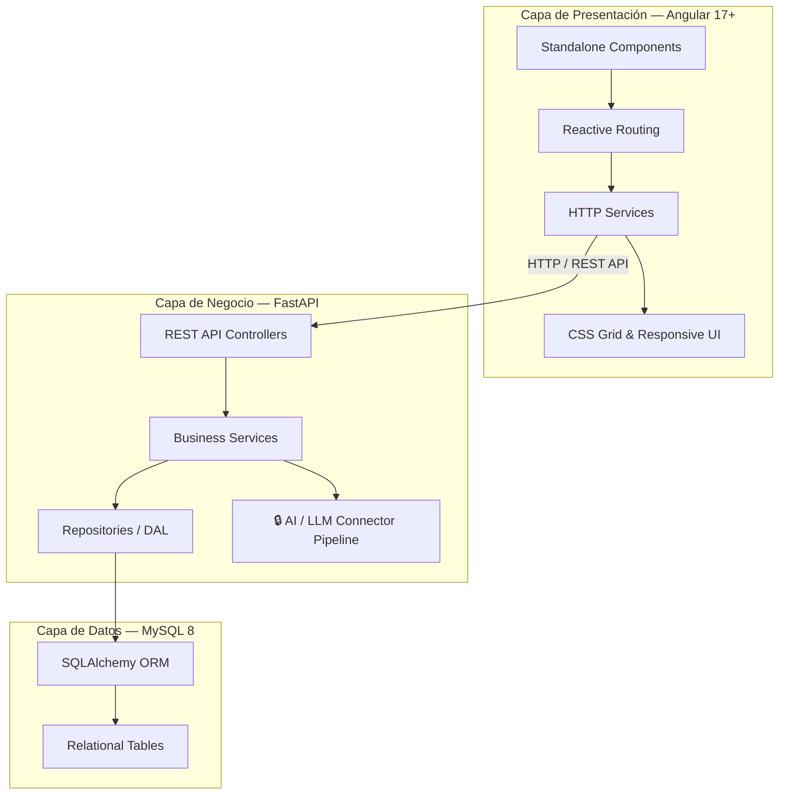
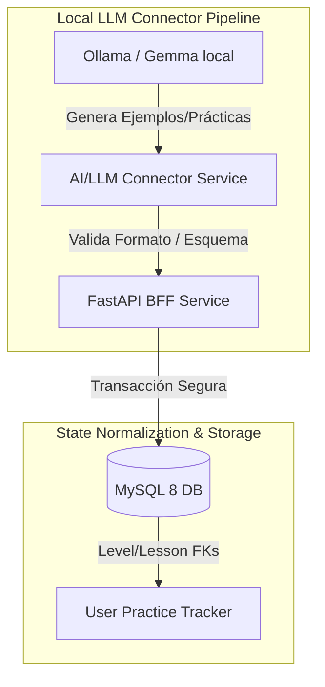

# 🏗️ English Coach App — Full-Stack Architecture Blueprint

Este documento constituye la fuente única de verdad (**Single Source of Truth**) sobre la arquitectura técnica de la plataforma, detallando el diseño del backend, persistencia, frontend, y definiendo la guía de escalado futuro para la integración segura de LLMs locales y nuevas mecánicas.

---

## 1. Arquitectura del Sistema (Full-Stack Blueprint)

### 1.1 Backend: FastAPI & Python 3.11+
El backend está estructurado siguiendo principios de **Clean Architecture** y patrones de **DDD (Domain-Driven Design)** de forma simplificada, desacoplando completamente la lógica de negocio del framework y los mecanismos de persistencia:

*   **`app/api/v1/endpoints/`**: Controladores REST. Gestionan las solicitudes HTTP, delegan la lógica en los servicios de aplicación, y serializan los datos utilizando esquemas Pydantic para garantizar un contrato I/O estricto.
*   **`app/core/`**: Configuraciones generales del sistema, inyección de variables de entorno mediante `pydantic-settings` y middlewares globales de seguridad (CORS, etc.).
*   **`app/db/`**: Configuración del motor SQLAlchemy, pool de conexiones y sesiones transaccionales.
*   **`app/models/`**: Declaración de modelos relacionales SQLAlchemy utilizando tipado moderno y mapeo explícito de enums (por ejemplo, `LessonCategory` en la base de datos).
*   **`app/repositories/`**: Patrón de Repositorio (Data Access Object) para encapsular las consultas de base de datos (`SQLAlchemy`).
*   **`app/schemas/`**: Modelos Pydantic para la validación y tipado fuerte de entradas/salidas de la API.
*   **`app/services/`**: Lógica pura del dominio técnico y preparación para las futuras tuberías de IA.

### 1.2 Persistencia: SQLAlchemy ORM & MySQL 8
La base de datos utiliza una estructura relacional altamente normalizada:
*   **`Level`**: Código CEFR único (`A1`, `A2`, `B1`, `B2`, `C1`, `C2`), nombre y descripción estrictamente en inglés.
*   **`Lesson`**: Relacionada con un nivel. Posee tipo explícito (`grammar` o `phonetics`), categoría del LessonCategory Enum (e.g., `modal_verbs`, `general_grammar`), título y explicación extendida de la teoría.
*   **`Example`**: Asociado a una lección. Almacena la frase de estudio, su transcripción fonética oficial (IPA) y la traducción correspondiente al español.
*   **`Exercise`**: Pregunta orientada a validar la asimilación del contenido de la lección, con opciones de selección múltiple, completar el espacio o validación de pronunciación.

### 1.3 Seed Data Modular (`seed_data/`)
Para facilitar la escalabilidad del MVP y evitar archivos monolíticos de datos, las lecciones y materiales didácticos se organizan en módulos independientes dentro de `backend/scripts/seed_data/`. 
El seed pipeline (`seed.py`) se encarga de truncar completamente la base de datos y sembrar en orden secuencial garantizando la integridad referencial.

---

## 2. Frontend: Angular Standalone & SCSS Normalizado

El frontend está desarrollado con Angular moderno (v17+), priorizando la modularidad extrema y la limpieza estética sin depender de empaquetados pesados:

*   **Arquitectura de Standalone Components**: Todos los componentes del sistema prescinden de módulos tradicionales de Angular, importando directamente sus directivas y dependencias requeridas. Esto optimiza los tiempos de compilación y permite Lazy Loading dinámico nativo a través de rutas reactivas (`/level/:levelId`).
*   **Grid Layout Mental Model**: El grid principal implementa el estándar premium de doble columna uniforme para escritorio (`grid-cols-1 md:grid-cols-2 gap-6`) y una sola en móvil, alineando las alturas del layout flexbox de forma constante a fin de evitar saltos de línea irregulares.
*   **Baneo de Emojis e Integración de SVGs**: El uso de caracteres emoji está terminantemente prohibido para mantener la sobriedad técnica del producto. Toda iconografía utiliza elementos inline SVG ultraligeros con trazo unificado (`stroke-width="2"`) y escalas adaptativas (`w-5 h-5` o `w-6 h-6`).
*   **Componentes de Tabulación Premium**: Las interfaces de pestañas y botones de alternancia implementan transiciones suavizadas de estado (`transition: all 0.2s ease-in-out`), bordes definidos de alto contraste en estados activos y una ligera elevación/sombra HSL para un aspecto visual de primer nivel.

---

## 3. Guía de Escalado Futuro (Future Scaling Guide)

A medida que el proyecto avance hacia las fases 2, 3 y 4 (Text-to-Speech, Whisper STT, y Azure Pronunciation Assessment con soporte de LLMs locales), este instructivo define el camino correcto para expandir el sistema sin romper la normalización de la base de datos:

### 3.1 Módulo 1: Dynamic Practices & Time Trackers (Hito 2)
Para integrar el seguimiento del tiempo de estudio y la generación de prácticas sin afectar los datos semilla de las lecciones existentes:
1.  **Tablas de Progreso de Usuario (User State)**: Crear tablas relacionales separadas como `UserProgress` y `StudySession`. Estas deben asociarse a las lecciones mediante claves foráneas (`lesson_id`).
2.  **Integración no intrusiva**: El tracker de tiempo se comunicará con el backend mediante endpoints asíncronos (`POST /api/v1/sessions/start` y `/sessions/end`) sin sobrecargar la consulta de obtención de lecciones o niveles.

### 3.2 Módulo 2: OCI Ollama / Gemma LLM Connector Pipeline
Para integrar generación autónoma de contenido en local o llamadas remotas de inferencia:
1.  **Capa de Servicios de Inferencia**: Encapsular las llamadas en la ruta dedicada `/backend/app/services/ai/connector.py`.
2.  **Pydantic Structured Outputs**: Utilizar esquemas Pydantic estrictos para validar que la respuesta generada por Gemma/Llama cumpla con el contrato exacto de base de datos (e.g. descripciones estrictamente menores a 150 caracteres en inglés).
3.  **Mecanismo de Guardrails**: Antes de insertar cualquier ejemplo o ejercicio generado dinámicamente en las tablas del sistema, se debe forzar una rutina de sanitización para eliminar cualquier emoji o caracter no deseado generado por el LLM.

---
*Este documento es obligatorio para todo desarrollador e IA trabajando en el proyecto english-coach-app.*

---

## 4. Technical Debt Register

Las decisiones de arquitectura con compromisos deliberados o workarounds activos están documentadas en:

**[`docs/tech_debt.md`](./tech_debt.md)**

| ID | Feature | Workaround activo | Resolución |
|---|---|---|---|
| TD-001 | Advanced Prosody TTS — SSML | `pitch`/`rate` global en Web Speech API | Phase 4 — Azure/Google Cloud TTS con SSML |
